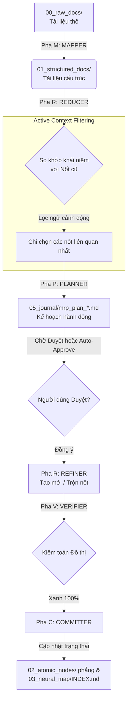

# 📖 Cẩm nang Tra cứu & Vận hành Hệ tri thức Harness MRP

Tài liệu này đóng vai trò là một **Từ điển Tra cứu Nhanh** và **Cẩm nang Vận hành** dành cho Hệ thống nạp tri thức tự động (MRP Ingestion Pipeline) và cấu trúc Đồ thị Tri thức phẳng (Causal Web).

---

## 📚 1. Thuật ngữ Cốt lõi (Glossary of Terms)

| Thuật ngữ | Định nghĩa | Ý nghĩa / Ứng dụng |
| :--- | :--- | :--- |
| **Harness (Khung gá)** | Bộ công cụ và quy trình bọc ngoài AI Agent nhằm kiểm soát phạm vi hoạt động (blast radius) và đảm bảo tính nhất quán. | "Framework viết cho lập trình viên, Harness viết cho AI". |
| **MRP Pipeline** | Viết tắt của **Map-Reduce-Plan-Refine-Verify-Commit**. | Luồng xử lý tuần tự để nạp tài liệu thô thành các nốt tri thức nguyên tử mà không bị trùng lặp. |
| **Atomic Node (Nốt nguyên tử)** | Tệp markdown lưu trữ độc lập tại `02_atomic_nodes/` chứa đúng một khái niệm/tri thức duy nhất. | Tránh bẫy gom quá nhiều thông tin vào một tệp hướng dẫn lớn gây tràn context. |
| **Structured Doc** | Tệp tri thức trung gian tại `01_structured_docs/` chứa bản tóm tắt đã được chuẩn hóa bởi LLM. | Giúp LLM tăng tốc độ đọc hiểu và lọc khái niệm chính. |
| **Causal Web (Mạng lưới nhân quả)** | Cấu trúc liên kết các nốt thông qua các thuộc tính frontmatter (`parent`, `children`, `evidence`). | Giúp hiển thị luồng Nguyên nhân - Duyên khởi - Kết quả một cách trực quan sinh động trên Obsidian Graph View. |
| **Active Context Filtering** | Cơ chế lọc và chỉ gửi các nốt liên quan nhất (khoảng 10-15 nốt) lên LLM thay vì toàn bộ vault. | Tiết kiệm ~85% chi phí token và tránh tình trạng loãng thông tin của LLM. |

---

## 📊 2. Quy trình xử lý 6 Pha của MRP Pipeline



### Chi tiết hành động từng pha:
1.  **Pha M (Mapper)**: Đọc tài liệu thô tại `00_raw_docs/` có trạng thái `status: to-process` để trích xuất concepts và tạo file cấu trúc tại `01_structured_docs/`.
2.  **Pha R (Reducer)**: Dùng **Active Context Filtering** để so khớp concepts mới với các nốt cũ nhằm tìm kiếm sự trùng lặp/xung đột.
3.  **Pha P (Planner)**: LLM phác thảo kế hoạch hành động chi tiết ghi nhận các hành động sẽ tạo mới hoặc trộn nốt tại `05_journal/mrp_plan_*.md`.
4.  **Pha R (Refiner)**: Thực hiện tạo mới hoặc trộn (gộp nội dung và chèn liên kết ngược dòng dẫn chứng `Evidence & Context` dẫn tới tài liệu gốc).
5.  **Pha V (Verifier)**: Thực hiện kiểm toán toàn vẹn liên kết (Link Audit) và kiểm toán cấu trúc cha-con hai chiều (Tree Integrity Audit).
6.  **Pha C (Committer)**: Cập nhật trạng thái file thô sang `processed`, cập nhật trạng thái file plan sang `executed` và ghi nhận chỉ mục vào `03_neural_map/INDEX.md`.

---

## 🔀 3. Chiến lược nhánh Git (`main` vs `template`)

Nhằm cô lập code Engine và Tri thức (Data), repository này chia thành hai nhánh chính:

*   **Nhánh `main`**: Chứa toàn bộ Engine và các tài liệu tri thức đang chạy hiện hành (Lectures, Atomic Nodes thực tế).
*   **Nhánh `template` (hoặc `base`)**: Chứa Engine, cấu trúc các thư mục trống, các quy tắc `RULE.md` gốc và mẫu định dạng `INDEX.md`, hoàn toàn **sạch bóng** các tri thức mẫu cụ thể.

### Workflow khi bắt đầu một kho tri thức mới hoàn toàn:
```bash
# 1. Clone và di chuyển vào repo
git clone <URL_REPO> my-new-vault && cd my-new-vault

# 2. Chuyển sang nhánh template sạch và tách nhánh dự án của bạn
git checkout template
git checkout -b feature/my-knowledge-base

# 3. Nạp tài liệu thô vào 00_raw_docs/ và kích hoạt pipeline
python3 -m scripts.mrp_pipeline batch --auto-approve
```

### Cập nhật nâng cấp Engine từ nhánh `template`:
Nếu trong tương lai Engine pipeline có cập nhật thuật toán hoặc nâng cấp tính năng kiểm toán, bạn chỉ cần gộp nhánh `template` vào nhánh tri thức của mình:
```bash
git checkout feature/my-knowledge-base
git fetch origin
git merge origin/template
```

---

## ⚙️ 4. Tùy chỉnh Tiền tố Tri thức (Atomic Prefix)

Theo mặc định, hệ tri thức sử dụng tiền tố viết tắt `HAE-` (Harness Engineering). Khi bạn xây dựng kho tri thức mới, hãy cấu hình lại tiền tố này theo domain của bạn.

### Gợi ý viết tắt tiền tố:
*   Kế toán / Thuế: `TAX-concept-` hoặc `ACC-concept-`
*   Lập trình / Công nghệ: `SWE-concept-` hoặc `ARC-concept-`
*   Pháp lý: `LGL-concept-`

### Cách thay đổi cấu hình:
Mở tệp cấu hình tại [scripts/mrp_pipeline/core/config.py](scripts/mrp_pipeline/core/config.py) và sửa lại dòng số **42**:
```python
# Sửa giá trị này thành tiền tố của riêng bạn
ATOMIC_PREFIX = "TAX-concept-"
```

---

## 🧹 5. Hướng dẫn Dọn dẹp thủ công (Trường hợp không dùng nhánh template)

Nếu bạn muốn dọn dẹp trực tiếp thư mục hiện tại để nạp tri thức mới mà không muốn chuyển nhánh git:
1.  Xóa tất cả các tệp `.md` trong `00_raw_docs/` (giữ lại `RULE.md`).
2.  Xóa tất cả các tệp `.md` trong `01_structured_docs/` (giữ lại `RULE.md`).
3.  Xóa tất cả các tệp `.md` trong `02_atomic_nodes/` (giữ lại `RULE.md`).
4.  Làm sạch tệp `03_neural_map/INDEX.md` (chỉ để lại các tiêu đề danh mục trống).
5.  Xóa các tệp checkpoint và kế hoạch trong `05_journal/`.
