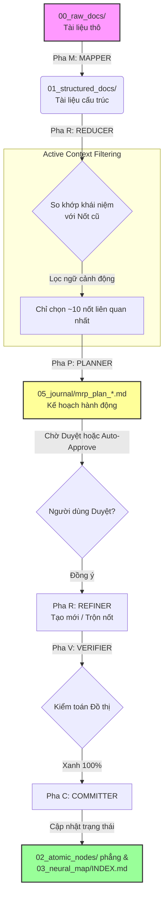

Viewed mrp_plan_20260531_194249.md:34-34

I will view the contents of the generated plan `mrp_plan_20260531_194249.md` to understand how the system structures its steps.

Viewed mrp_plan_20260531_194249.md:1-34

Hệ thống bạn đang chạy là một **MRP Ingestion Pipeline** (Luồng nạp tri thức dạng Map-Reduce-Plan). Mục tiêu tối thượng của nó là tự động hóa việc đọc tài liệu thô, biến chúng thành các **Nốt Tri Thức Nguyên Tử (Atomic Nodes)** phẳng, đan xen chặt chẽ bằng các liên kết Nhân-Quả (Causal Web) trên Obsidian Graph View mà không bị trùng lặp tri thức.

Dưới đây là sơ đồ và chi tiết cách thức hoạt động của 6 pha trong hệ thống:

### 📊 Sơ đồ Luồng Hoạt Động (MRP Pipeline)

---

### 🔍 Chi tiết 6 Pha hoạt động

#### 1. Pha M - MAPPER (Phân tích tài liệu thô)
*   **Đầu vào**: Một tệp tài liệu thô (ví dụ: `lecture-15-token-budget-under-large-load.md`) có trạng thái `status: to-process`.
*   **Hành động**: LLM đọc lướt qua tệp thô để trích xuất các **từ khóa (concepts)**, nội dung tóm tắt sẵn sàng cho AI (AI-ready summary) và các điểm cốt lõi (key takeaways).
*   **Đầu ra**: Tạo ra tệp đã cấu trúc tại `01_structured_docs/...-processed.md`.

#### 2. Pha R - REDUCER (Phân tích trùng lặp và xung đột)
*   **Đầu vào**: Các từ khóa từ Pha M và toàn bộ các nốt nguyên tử cũ trong `02_atomic_nodes/`.
*   **Hành động**: Thay vì gửi toàn bộ hàng trăm nốt cũ lên LLM (gây tốn token và loãng ngữ cảnh), hệ thống dùng **Active Context Filtering** (quét local nhanh) để chỉ lọc ra khoảng 10-15 nốt có liên quan nhất. LLM sau đó đối chiếu khái niệm mới với nhóm nốt này để xác định:
    *   *Khái niệm này hoàn toàn mới?* $\rightarrow$ Chuẩn bị tạo nốt mới.
    *   *Khái niệm này đã tồn tại ở nốt cũ nhưng có thông tin bổ sung?* $\rightarrow$ Chuẩn bị gộp (Merge).

#### 3. Pha Pha P - PLANNER (Thiết kế và Xuất bản Kế hoạch)
*   **Hành động**: LLM lập một bản kế hoạch chi tiết (`05_journal/mrp_plan_*.md`) mô tả chính xác những nốt nào sẽ được tạo mới, nốt nào sẽ bị trộn nội dung, mối quan hệ Cha-Con (Parent-Children) và mối quan hệ Nhân-Quả.
*   **Điểm dừng (Gate)**: Ở chế độ chạy thường, hệ thống sẽ dừng lại tại đây để đợi bạn gõ lệnh duyệt. Ở chế độ Batch Test, hệ thống sẽ tự động duyệt qua để chạy thông suốt.

#### 4. Pha R - REFINER (Thực thi Kế hoạch)
*   **Hành động**: Thực thi các hành động trong kế hoạch:
    *   **Tạo mới**: Tạo nốt phẳng tại `02_atomic_nodes/HAE-concept-[slug].md`.
    *   **Trộn (Merge)**: Cập nhật nội dung nốt cũ, và **tự động chèn liên kết ngược dòng dẫn chứng** (backlinks) về tệp thô ban đầu để đảm bảo tính truy vết nguồn gốc (Evidence Traceability).

#### 5. Pha V - VERIFIER (Kiểm toán Đồ thị)
*   **Hành động**: Chạy thuật toán đồ thị để kiểm tra:
    *   *Link Audit*: Phát hiện nếu có liên kết Markdown nào bị hỏng/gãy hoặc đường dẫn tuyệt đối (vi phạm tính Portable).
    *   *Tree Integrity*: Đảm bảo mối liên kết Cha-Con hai chiều luôn nhất quán (Ví dụ: Nốt cha khai báo có nốt con $B$, thì nốt con $B$ cũng phải khai báo có nốt cha $A$).

#### 6. Pha C - COMMITTER (Đóng dấu hoàn thành)
*   **Hành động**: 
    *   Thay đổi trạng thái tệp thô ban đầu sang `status: processed`.
    *   Đánh dấu tệp kế hoạch sang `executed`.
    *   Tự động chèn link nốt mới vào mục lục `03_neural_map/INDEX.md` tương ứng với phân nhóm của nó.

---

### 💡 Tại sao E2E Test của bạn lại "Thành công rực rỡ"?
Khi chạy test E2E cho 3 tệp `lecture-14`, `lecture-15` và `lecture-16`:
1.  **Lecture 14** tạo ra nốt mới `blast-radius-isolation`.
2.  **Lecture 15** (cũng nhắc về blast radius) được đưa vào. Nhờ **Reducer**, hệ thống nhận diện khái niệm này trùng lặp và **trộn nội dung** vào nốt `blast-radius-isolation` có sẵn, đồng thời tự động nối dẫn chứng ngược dòng của Lecture 15 vào cuối nốt, tránh tạo nốt trùng lặp.
3.  **Lecture 16** tạo ra nốt trực quan hóa `semantic-graph-visualization`.
4.  Cuối cùng bộ kiểm toán xác nhận đồ thị sạch 100% không có lỗi liên kết.